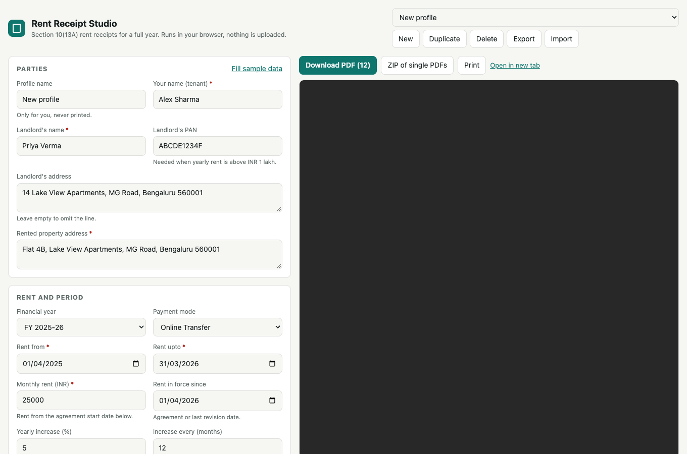
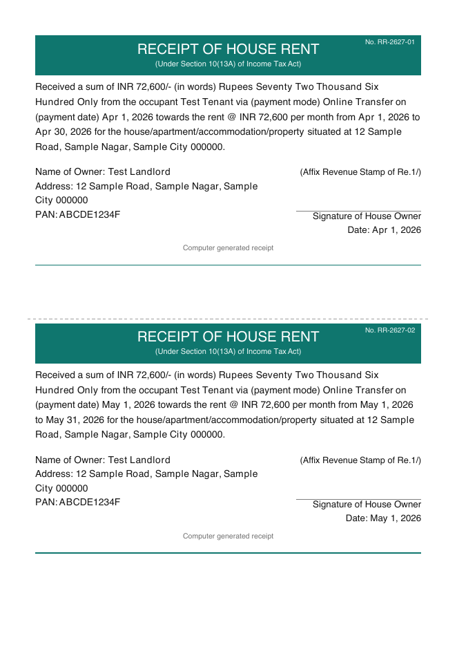

# Rent Receipt Studio

[](https://github.com/nmtjn1997/rent-receipt-studio/actions/workflows/ci.yml)

Make a full year of rent receipts for HRA (Section 10(13A)) in one go. Free, no watermark, no signup.
Everything runs in your browser, so your PAN, names and addresses are never uploaded anywhere.

**Use it now:** https://nmtjn1997.github.io/rent-receipt-studio/
**Offline copy:** download `rent-receipt.html` from [Releases](https://github.com/nmtjn1997/rent-receipt-studio/releases) and double-click it.

<p>
  
  
</p>

## What it does

- Picks a financial year and builds every month for you (12 receipts, or as many as you choose).
- Handles yearly rent increases (for example 10% each April) and lets you override any single month.
- Prorates part months, or charges the full month, your call.
- One receipt per month, per quarter, per half-year, or one consolidated receipt.
- 1 to 4 receipts per A4 page, three templates, three fonts, your accent colour, optional receipt numbers.
- Amount in words the Indian way (lakh, crore). Dates in three styles.
- Upload a signature image, or leave the line blank to sign after printing.
- Saved profiles (several flats or landlords), JSON import and export, ZIP of single PDFs, print.
- Warns about missing PAN, future-dated receipts, cash stamp and TDS rules. See [docs/TAX-NOTES.md](docs/TAX-NOTES.md).

## Run it your way

| Option | Command |
|---|---|
| GitHub Pages | Fork, set Pages source to GitHub Actions, push. See [docs/HOSTING.md](docs/HOSTING.md) |
| Node (macOS, Windows, Linux) | `npm ci && npm run serve` then open http://127.0.0.1:5178 |
| Docker | `docker compose up -d --build` then open http://localhost:8080 |
| One file, no install | `npm run build:single` gives `dist-single/rent-receipt.html` |

Needs Node 20+ for the npm route. Docker images are built for amd64 and arm64.

## Keep your details local

Your own profile can be preloaded without ever being committed. Copy the example and edit it:

```bash
cp src/seed.example.json src/seed.local.json
```

`src/seed.local.json` is gitignored, is read only by `npm run dev`, and `npm run build` fails, naming the field, if any of its private values reach the bundle. Values copied unchanged from the example are public, so they never trigger it.
More in [docs/PRIVACY.md](docs/PRIVACY.md).

## Develop

```bash
npm ci
npm run dev        # http://127.0.0.1:5177
npm run verify     # typecheck, unit tests, build, one-file build, browser tests
npm run samples    # writes sample PDFs to ./out for a visual check
```

How the pieces fit, with sequence diagrams: [docs/ARCHITECTURE.md](docs/ARCHITECTURE.md).
Working on it with an AI coding agent: [AGENTS.md](AGENTS.md). Contributing: [CONTRIBUTING.md](CONTRIBUTING.md).

## Disclaimer

A formatting tool, not tax advice. Issue a receipt only for rent that was actually paid.

MIT licensed.
