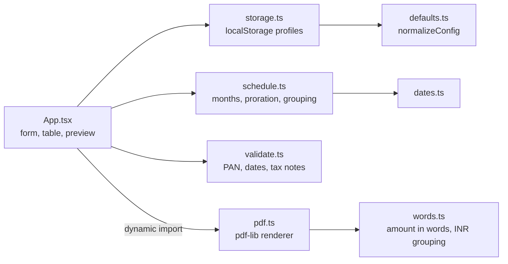
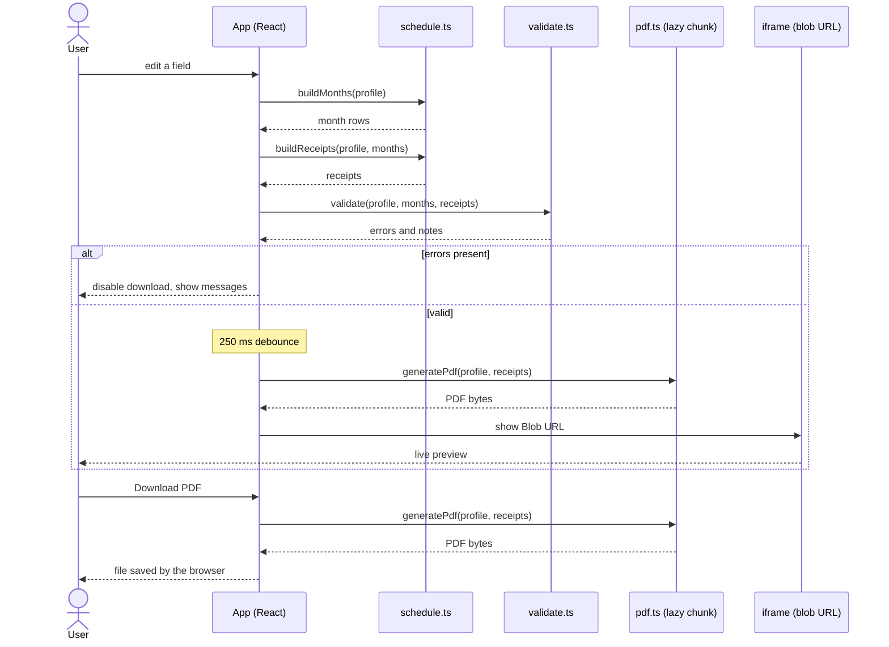
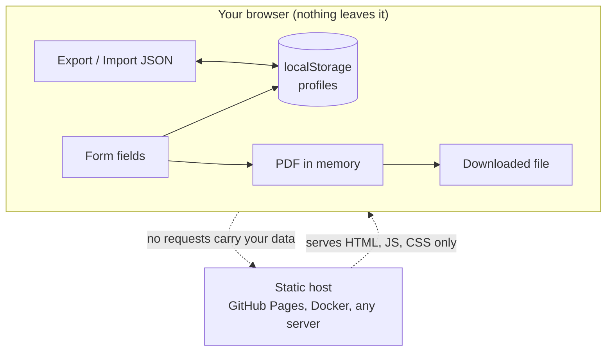
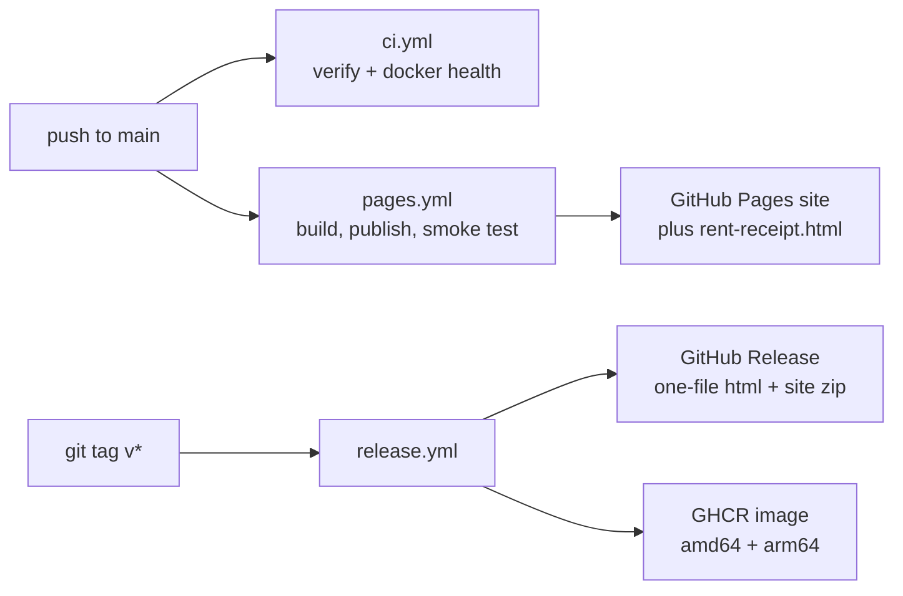

# Architecture

Everything runs in the visitor's browser. There is no server component, database or API.

## Modules

| Module | Responsibility |
|---|---|
| `src/lib/schedule.ts` | Turns a profile into month rows (flat rent, proration, hand-set months) and then into receipts (monthly, quarterly, half-yearly, consolidated). Pure functions. |
| `src/lib/pdf.ts` | Lays receipts out on A4 with pdf-lib. Three templates, 1 to 4 per page, bold values, text stays selectable. |
| `src/lib/validate.ts` | Blocking errors (missing names, bad PAN) and advisory notes (future dates, TDS, stamp). |
| `src/lib/defaults.ts` | `normalizeConfig` coerces any untrusted object into a valid profile. |
| `src/lib/storage.ts` | Reads and writes profiles in `localStorage`. Loads `src/seed.local.json` under `vite dev` only. |

## Generating a receipt PDF

The preview is the real output. What you see is the file you download.

## Where data lives

Three independent guards keep it that way:

1. The code makes no network calls other than loading its own static files.
2. The Docker image sends `connect-src 'none'`, so the browser itself blocks any outgoing request from the page.
3. `scripts/check-dist.mjs` fails the build if any value from a private `src/seed.local.json` appears in the output.

## Build and release pipeline

## Build variants

| Command | Output | Use |
|---|---|---|
| `npm run build` | `dist/` (relative asset paths) | Any static host, sub-path safe |
| `npm run build:single` | `dist-single/rent-receipt.html` | One file, opens from disk, works offline |
| `docker build .` | nginx image on port 8080 | Servers, NAS, Raspberry Pi |
