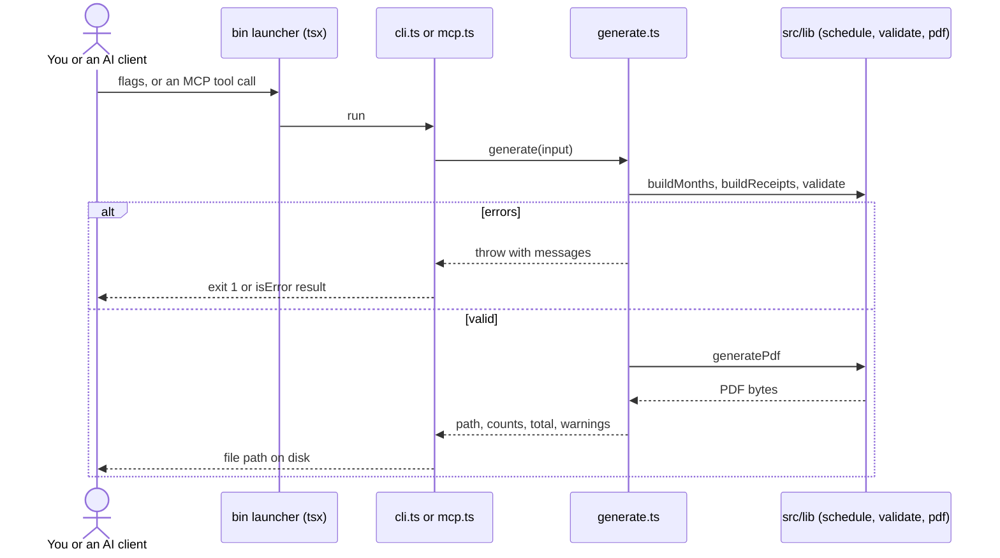

# Command line and MCP

Make the same PDF without opening a browser. Needs Node 22.13+ and a clone of this repo (`npm ci` once).

## CLI

Four things are required: tenant, landlord, property address, monthly rent.

```bash
npm run cli -- --tenant "Alex Sharma" --landlord "Priya Verma" \
  --property "Flat 4B, Lake View, Bengaluru" --rent 25000 --pan ABCDE1234F \
  --fy 2026 --through 2026-09
```

```
6 receipts for 6 months, INR 1,50,000 in total
2026-04-01 to 2026-09-30
/your/current/dir/rent-receipts-alex-sharma-fy2026-27.pdf
```

| Flag | Meaning | Default |
|---|---|---|
| `--tenant` `--landlord` `--property` `--rent` | The four required values | none |
| `--fy 2026` | Financial year, 2026 is FY 2026-27 | current FY |
| `--through 2026-09` | Stop after this month, so nothing is dated in the future | whole FY |
| `--from` `--to` | Exact dates instead of a whole FY | FY bounds |
| `--grouping` | `monthly`, `quarterly`, `half-yearly`, `consolidated` | `monthly` |
| `--pan` | Landlord PAN | none |
| `--landlord-address` | Owner address | the property address |
| `--mode` | Payment mode | `Online Transfer` |
| `--pay-day` | Day of month rent is paid | `1` |
| `--per-page` | Receipts per page, 1 to 4 | `2` |
| `--template` `--font` `--date-format` | Look | `classic`, `Helvetica`, `mdy` |
| `--no-stamp` | Drop the revenue stamp line | stamp on |
| `--profile file.json` | A profile exported from the web app supplies any missing value | none |
| `--out file.pdf` | Output path | `./rent-receipts-<tenant>-fy<year>.pdf` |
| `--json` | Machine-readable result | off |

Exit code 0 on success, 1 with a message on stderr otherwise. To have the command anywhere on your machine, run `npm link` in the repo, then use `rent-receipt ...`.

Keeping your own details out of shell history: export a profile from the web app and pass `--profile`. Then only `--fy` and `--through` change from year to year.

## MCP server

`bin/rent-receipt-mcp.mjs` speaks MCP over stdio and exposes one tool, `generate_rent_receipts`, with the same inputs (`tenant`, `landlord`, `property`, `rent` required). It writes the PDF on your machine and returns the file path.

Claude Code:

```bash
claude mcp add rent-receipt -- node /absolute/path/to/rent-receipt-studio/bin/rent-receipt-mcp.mjs
```

Any other client (Cursor, Claude Desktop) takes the same command in its MCP config:

```json
{ "mcpServers": { "rent-receipt": { "command": "node", "args": ["/absolute/path/to/rent-receipt-studio/bin/rent-receipt-mcp.mjs"] } } }
```

Then ask: "Make my rent receipts for FY 2026-27 up to September, rent 25000, landlord Priya Verma, ...".

## How it fits



The CLI, the MCP server and the web app all call the same `src/lib` code, so the PDF is identical.
